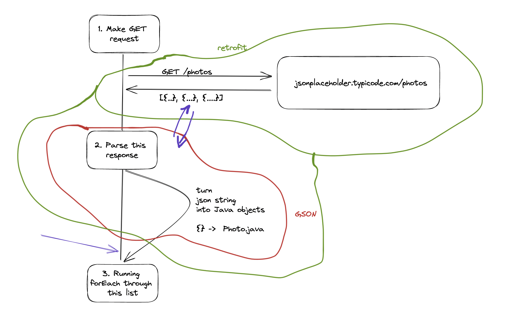

# Basic Java Project 

## Diagrams 

### 1. How Retrofit and GSON work together



## Build 

### Create Jar 

```bash
./gradlew build
```

The jar would be generated in `build/libs` folder.

### Creating Fat Jars 

A fat jar is a jar file that includes all the required libraries inside it. 
Far jars are easy to distribute and deploy as they do not require anything other
than a working Java Runtime Environment to run. 

Add this to `build.gradle`

```groovy
jar {
    manifest.attributes["Main-Class"] = "com.scaler.Main"
    duplicatesStrategy = DuplicatesStrategy.EXCLUDE
    from { configurations.runtimeClasspath.collect { it.isDirectory() ? it : zipTree(it) } }
}
```
or

Add this to `build.gradle.kts`
```kts

tasks.withType<Jar> {
    manifest {
        attributes["Main-Class"] = "com.scaler.Main"
    }
    duplicatesStrategy = DuplicatesStrategy.EXCLUDE
    from(configurations.runtimeClasspath.get().map({ if (it.isDirectory) it else zipTree(it) }))
}
```

Build and run the jar file
```bash
./gradlew build
java -jar build/libs/java-basics-1.0-SNAPSHOT.jar
```

## Assignments 

### 01: Merge Sort Files 

#### Problem Statement

Inside the folder [/files](./files) there are 2 files 
- [in1.txt](./files/in1.txt)
- [in2.txt](./files/in2.txt)

The both contain some numbers (separate numbers in each line).

You have to read both files, merge all the numbers into one sorted array 
and then print that into a third file [out.txt](./files/out.txt)

#### Example 

##### Input
Contents of `in1.txt`
```
4
7
2
```

Contents of `in2.txt`
```
1 
9
3
```

##### Output 
Contents of `out.txt`
```
1
2
3
4
7
9
```

##### Bonus 

- Level 1: Make the program work for any number of files.
- Level 2: Make sure that the file read and write operations are on a separate thread 
- Level 3: Make sure that the read operations can be all done in parallel (i.e. we are not waiting for file 1 to be read before we read file 2)

#### Submissions 

- Create a new repository under your own account (not a fork of this repo) 
- Create a `files` folder and copy `in1.txt` and `in2.txt` into it
- Finish the assignment, and upload the `out.txt` file to the `files` folder 
- The repository should contain the final working code as well as the `out.txt` file
- Submit your assignment on [this form](https://docs.google.com/forms/d/e/1FAIpQLSd04RVGJCkye5RvYhARL1cN2TSWZmLw9LeCTLbk1iw7lv5JEw/viewform)